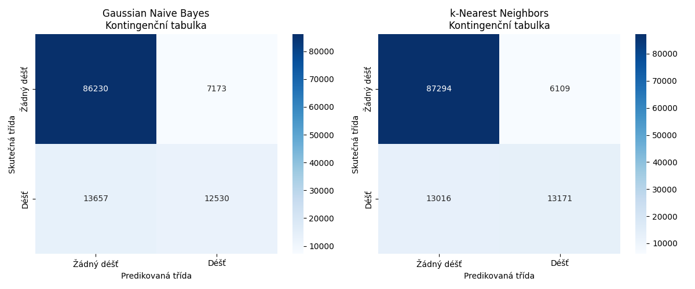

Install dependencies:  
```python
pip install -r requirements.txt
``` 
Can be run with:  
```python
python src/main.py
```
<p align="center">
<br/>
</p>
Tyto grafy představují **kontingenční tabulky** pro klasifikační modely: **Gaussian Naive Bayes** (vlevo) a **k-Nearest Neighbors (k-NN)** (vpravo). Kontingenční tabulka slouží k hodnocení výkonu klasifikačních modelů, který ukazuje skutečné hodnoty proti predikovaným hodnotám.

#### Osa x (Predikovaná třída):
  - **Žádný déšť** (predikováno, že nebude pršet).
  - **Déšť** (predikováno, že bude pršet).

#### Osa y (Skutečná třída):
  - **Žádný déšť** (ve skutečnosti nepršelo).
  - **Déšť** (ve skutečnosti pršelo).


### Tabulka je rozdělena na čtyři kvadranty, které představují jednotlivé případy:

1. **První kvadrant (vlevo nahoře)**: 
   - Skutečná třída je "Žádný déšť" a model správně predikoval "Žádný déšť".
   
2. **Druhý kvadrant (vpravo nahoře)**:
   - Skutečná třída je "Žádný déšť", ale model nesprávně predikoval "Déšť".


3. **Třetí kvadrant (vlevo dole)**:
   - Skutečná třída je "Déšť", ale model nesprávně predikoval "Žádný déšť".


4. **Čtvrtý kvadrant (vpravo dole)**:
   - Skutečná třída je "Déšť" a model správně predikoval "Déšť".


### Porovnání modelů:
- **Gaussian Naive Bayes** má více nesprávných predikcí v obou kvadrantech pro falešně pozitivní (7 173) i falešně negativní (13 657) ve srovnání s k-NN.
- **k-Nearest Neighbors (k-NN)** dosáhl lepších výsledků: má nižší počet falešných predikcí v obou případech (6 109 falešně pozitivní a 13 016 falešně negativní) a také mírně vyšší počet správně klasifikovaných případů déšť.

Celkově lze z těchto tabulek vidět, že **k-NN model** vykazuje o něco lepší přesnost než **Naive Bayes**, zejména díky menšímu počtu falešných pozitivních predikcí (kdy model předpovídal déšť, ale žádný nebyl).

Celková přesnost:  
Gaussian Naive Bayes: 0.826  
k-Nearest Neighbors: 0.840